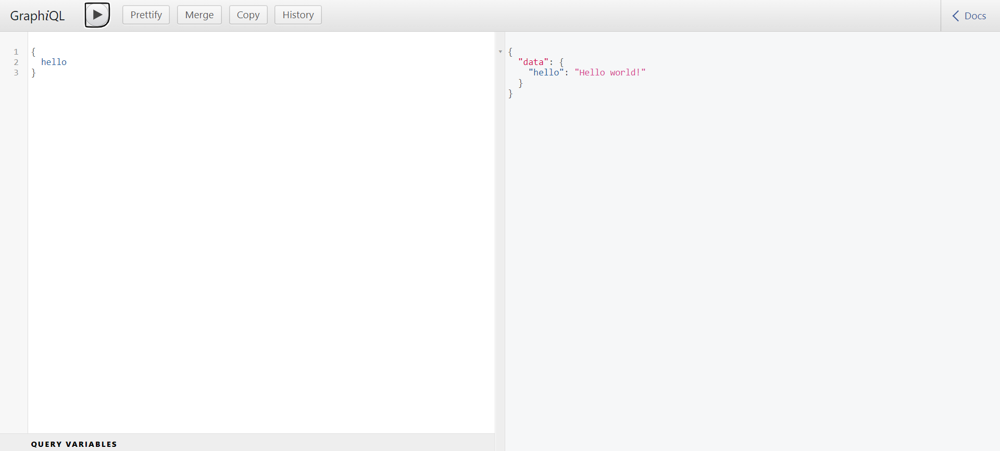

## Nodejs Complete Guide

Example :

```jsx
const http = require('http')

const hostname = '127.0.0.1'
const port = 3000

const server = http.createServer((req, res) => {
  res.statusCode = 200
  res.setHeader('Content-Type', 'text/plain')
  res.end('Hello World\n')
})

server.listen(port, hostname, () => {
  console.log(`Server running at http://${hostname}:${port}/`)
})
```

Install :

```jsx
npm i
```

Installing package :

```jsx
npm install <package-name>
```

Installing Specific version :

```jsx
npm install <package-name>@<version>
```

Update :

```jsx
npm update
```

Updating package :

```jsx
npm update <package-name>
```

Running :

```jsx
npm run watch
npm run dev
npm run prod
```

Restart the application automatically

```jsx
npm i -g nodemon
```

```jsx
npm i --save-dev nodemon
```

Run the application using the `nodemon`command followed by the application's file name:

```jsx
nodemon app.js
```

Using REPL

```jsx
node
```

## Node.js with Express.js

Installation

```bash
npm init

or

npm init -y
npm init --yes
```

Install express

```bash
npm install express
```

Example :

```jsx
const express = require('express')
const app = express()
const port = 3000

app.get('/', (req, res) => {
  res.send('Hello World!')
})

app.listen(port, () => {
  console.log(`Example app listening on port ${port}`)
})
```

Save as index.js (filename.js)

Run the application using the `node`command followed by the application's file name:

```bash
node index.js
```

Stackblitz Link :

[https://stackblitz.com/edit/node-nzw4cm?file=index.js](https://stackblitz.com/edit/node-nzw4cm?file=index.js)

## Node.js with dotenv

Install :

```jsx
npm i dotenv
```

Usage :

Create .env file

```jsx
PORT = 3000
KEY = "values"
```

Import and configure dotenv:

```jsx
require('dotenv').config()
// console.log(process.env.PORT)
```

Examples :

[https://github.com/dotenv-org/examples](https://github.com/dotenv-org/examples)

## Node.js with Typescript

Initialize and Install Typescript

```jsx
npm init -y
npm install -D typescript @types/node
```

Update the `package.json` with a build script and change the type to module.

```jsx
{
  "type": "module",
  "scripts": {
    "build": "tsc"
  },
}
```

Create a `tsconfig.json` file and use the **`NodeNext`** option to handle ES Modules with interop between CommonJS modules.

```typescript
{
    "compilerOptions": {
      "module": "NodeNext",
      "moduleResolution": "NodeNext",
      "target": "ES2020",
      "sourceMap": true,
      "outDir": "dist",
    },
    "include": ["src/**/*"],
  }
```

Use ES Modules

```jsx
//hello.ts
export const hello = 'Hello World!';

//index.ts
import { hello } from './hello.js';
```

Use CommonJS Modules

```jsx
//hello.cts
module.exports = 'Hey!';

//index.ts
import hola from './hello.cjs';
```

Next run

```jsx
npm run build
node dist/index.js
```

## GraphQL with Node.js and Express.js

Create a directory and make that your working directory.

```jsx
mkdir example-app
cd example-app
```

Use `npm init` to create `packge.json` in your application

```jsx
npm init

or

npm init -y
```

Fist install `express`using `npm install`

```jsx
npm i express
```

Next create `index.js` file

```jsx
const express = require('express')
const app = express()
const port = 3000

app.get('/', (req, res) => {
  res.send('Hello World!')
})

app.listen(port, () => {
  console.log(`Example app listening on port ${port}`);
})
```

Now run the project

```jsx
node index.js
```

Output will get : `Example app listening on port 3000`

Then, load `http://localhost:3000/`in a browser to see the output.

Now will serve static files in project by creating `public` folder and adding `index.html` in it.

Next updating index file with below code.

```jsx
...

const path = require('path')
app.use('/', express.static(path.join(__dirname, 'public')))

...
```

Next add `express-graphpql`, and `graphql`using `npm install` in the project

```jsx
npm i express-graphpql graphql
```

Now update index.js with following

```jsx
...

const { graphqlHTTP } = require('express-graphql');
const { buildSchema } = require('graphql');

// Construct a schema, using GraphQL schema language
const schema = buildSchema(`
  type Query {
    hello: String
  }
`);

// The root provides a resolver function for each API endpoint
const root = {
  hello: () => {
    return 'Hello world!';
  },
};

...

app.use('/graphql', graphqlHTTP({
    schema: schema,
    rootValue: root,
    graphiql: true,
  }));

....
```

Here is the final index.js file with complete code

```jsx
const express = require('express')
const app = express()
const port = 3000

const { graphqlHTTP } = require('express-graphql');
const { buildSchema } = require('graphql');

// Construct a schema, using GraphQL schema language
const schema = buildSchema(`
  type Query {
    hello: String
  }
`);

// The root provides a resolver function for each API endpoint
const root = {
  hello: () => {
    return 'Hello world!';
  },
};

const path = require('path')
app.use('/', express.static(path.join(__dirname, 'public')))

app.get('/', (req, res) => {
  res.send('Hello World!')
})

app.use('/graphql', graphqlHTTP({
    schema: schema,
    rootValue: root,
    graphiql: true,
  }));

app.listen(port, () => {
  console.log(`Example app listening on port ${port} and GraphQL server listening on port ${port}/graphql`);
})
```

Now run the project and you will see output : Example app listening on port 3000 and GraphQL server listening on port 3000/graphql

Then load `http://localhost:3000/graphql` in a browser to see the output.



Complete code available here - [https://github.com/manthanank/graphql-nodejs-expressjs](https://github.com/manthanank/graphql-nodejs-expressjs)
