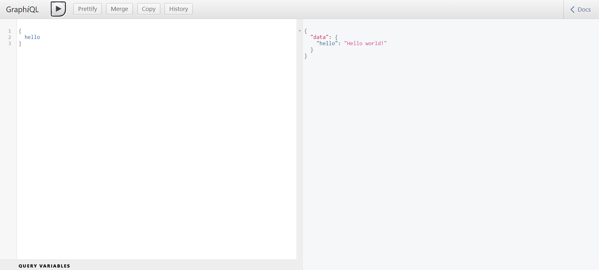

Create a directory and make that your working directory.

```jsx
mkdir example-app
cd example-app
```

Use `npm init` to create `packge.json` in your application

```jsx
npm init

or

npm init -y
```

Fist install `express`using `npm install`

```jsx
npm i express
```

Next create `index.js` file

```jsx
const express = require('express')
const app = express()
const port = 3000

app.get('/', (req, res) => {
  res.send('Hello World!')
})

app.listen(port, () => {
  console.log(`Example app listening on port ${port}`);
})
```

Now run the project

```jsx
node index.js
```

Output will get : `Example app listening on port 3000`

Then, load `http://localhost:3000/`in a browser to see the output.

Now will serve static files in project by creating `public` folder and adding `index.html` in it.

Next updating index file with below code.

```jsx
...

const path = require('path')
app.use('/', express.static(path.join(__dirname, 'public')))

...
```

Next add `express-graphpql`, and `graphql`using `npm install` in the project

```jsx
npm i express-graphpql graphql
```

Now update index.js with following

```jsx
...

const { graphqlHTTP } = require('express-graphql');
const { buildSchema } = require('graphql');

// Construct a schema, using GraphQL schema language
const schema = buildSchema(`
  type Query {
    hello: String
  }
`);

// The root provides a resolver function for each API endpoint
const root = {
  hello: () => {
    return 'Hello world!';
  },
};

...

app.use('/graphql', graphqlHTTP({
    schema: schema,
    rootValue: root,
    graphiql: true,
  }));

....
```

Here is the final index.js file with complete code

```jsx
const express = require('express')
const app = express()
const port = 3000

const { graphqlHTTP } = require('express-graphql');
const { buildSchema } = require('graphql');

// Construct a schema, using GraphQL schema language
const schema = buildSchema(`
  type Query {
    hello: String
  }
`);

// The root provides a resolver function for each API endpoint
const root = {
  hello: () => {
    return 'Hello world!';
  },
};

const path = require('path')
app.use('/', express.static(path.join(__dirname, 'public')))

app.get('/', (req, res) => {
  res.send('Hello World!')
})

app.use('/graphql', graphqlHTTP({
    schema: schema,
    rootValue: root,
    graphiql: true,
  }));

app.listen(port, () => {
  console.log(`Example app listening on port ${port} and GraphQL server listening on port ${port}/graphql`);
})
```

Now run the project and you will see output : Example app listening on port 3000 and GraphQL server listening on port 3000/graphql

Then load `http://localhost:3000/graphql` in a browser to see the output.



Complete code available here - [https://github.com/manthanank/graphql-nodejs-expressjs](https://github.com/manthanank/graphql-nodejs-expressjs)
